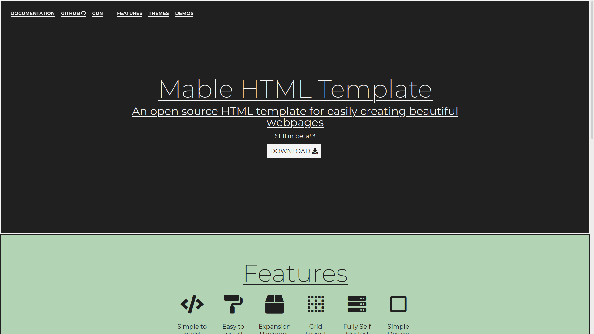
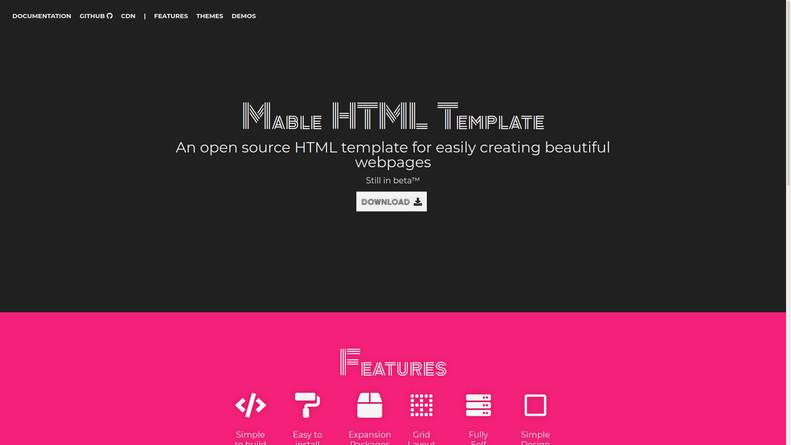

# Mable CDN: Themes

To install any of the following themes on a page, paste the line of code provided below the main Mable CSS file as well as any packages.

Example:

```html
<head>
    <!-- Page Info -->
    <title>This is a sample Mable HTML Header</title>

    <!-- CSS Sheets -->
    <link href="css/style.css" type="text/css" rel="stylesheet">

    <!-- Packages -->
    <link href="packages/sample-package.css" type="text/css" rel="stylesheet">
		
    <!-- Themes -->
    <link rel="stylesheet" type="text/css" href="themes/sample-theme" id="custom-theme-sheet">

    <!-- Other Things -->
    <meta name="viewport" content="width=device-width, initial-scale=1.0">
</head>
```

## BenjiStokman


```html
<link rel="stylesheet" type="text/css" href="https://cdn.mablesite.com/themes/benjistokman.css"  id="custom-theme-sheet">
```

## Lines



```html
<link rel="stylesheet" type="text/css" href="https://cdn.mablesite.com/themes/lines.css"  id="custom-theme-sheet">
```

## Zen Tokyo Zoo



```html
<link rel="stylesheet" type="text/css" href="https://cdn.mablesite.com/themes/zen-tokyo-zoo.css"  id="custom-theme-sheet">
```