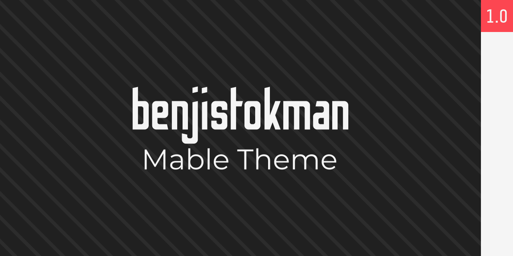
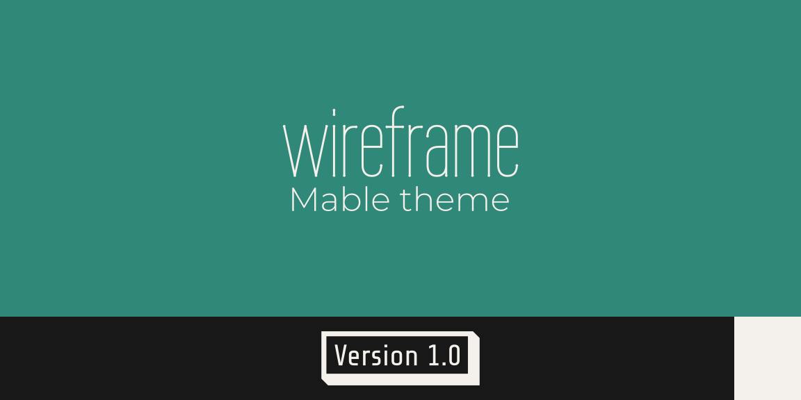

# Mable CDN: Themes

To install any of the following themes on a page, paste the line of code provided below the main Mable CSS file as well as any packages.

Example:

```html
<head>
	<!-- Page Info -->
	<title>This is a sample Mable HTML Header</title>
	<meta name="description" content="Page Description">
	<meta name="keywords" content="Page, Tags">
	<meta property="og:image" content="https://full-url">
	<link href="../images/brand/favicon.png" rel="shortcut icon">
	<meta name="viewport" content="width=device-width, initial-scale=1.0">

	<!-- CSS Sheets -->
	<link type="text/css" rel="stylesheet" href="css/style.css">
		
	<!-- Themes -->
	<link type="text/css" rel="stylesheet" href="themes/sample-theme" id="custom-theme-sheet">

	<!-- Packages -->
	<link type="text/css" rel="stylesheet" href="packages/sample-package.css">
</head>
```

## Autumn

```html
<link rel="stylesheet" type="text/css" href="https://cdn.mablesite.com/themes/autumn.css" id="custom-theme-sheet">
```

## BenjiStokman



```html
<link rel="stylesheet" type="text/css" href="https://cdn.mablesite.com/themes/benjistokman.css" id="custom-theme-sheet">
```

## Brandon

```html
<link rel="stylesheet" type="text/css" href="https://cdn.mablesite.com/themes/brandon.css" id="custom-theme-sheet">
```

## OpenDyslexic

```html
<link rel="stylesheet" type="text/css" href="https://cdn.mablesite.com/themes/opendyslexic.css" id="custom-theme-sheet">
```

## Wireframe



```html
<link rel="stylesheet" type="text/css" href="https://cdn.mablesite.com/themes/wireframe.css" id="custom-theme-sheet">
```